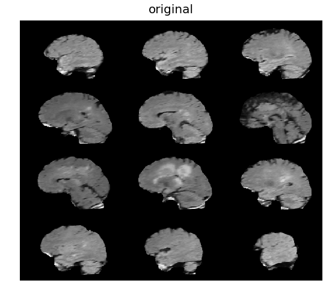
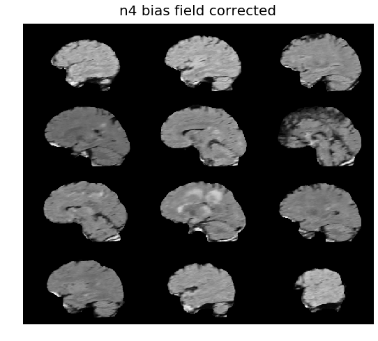
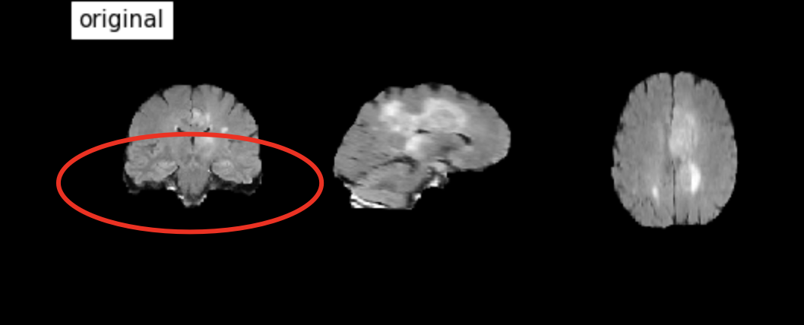
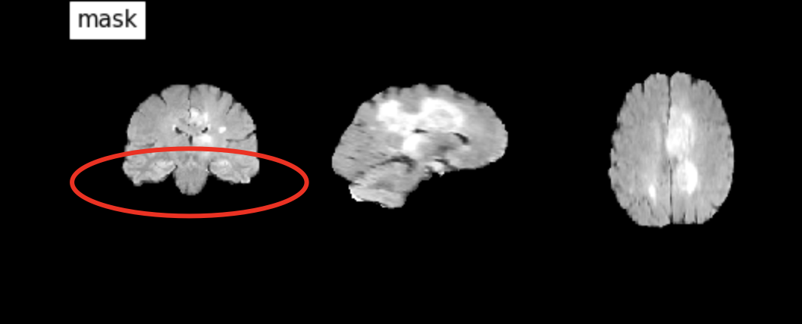
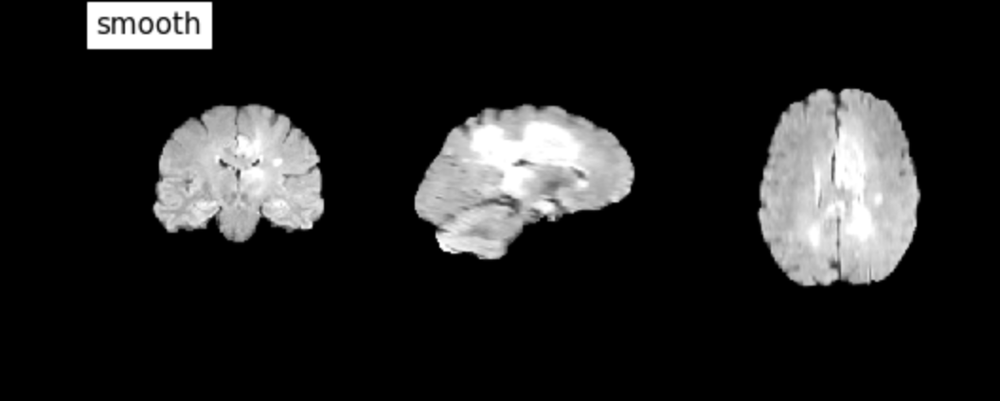
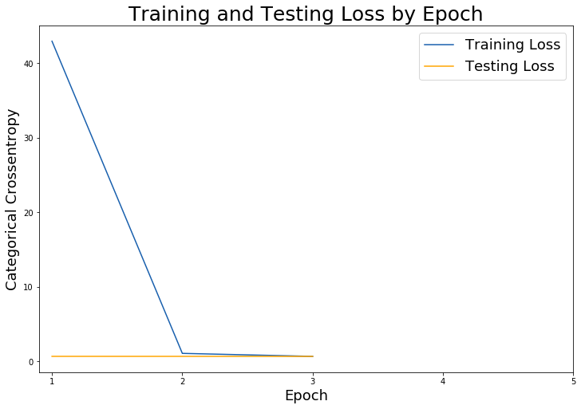
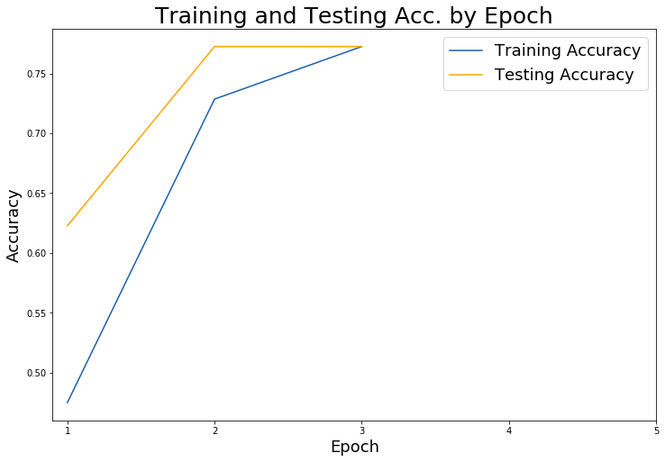

# **Brain Tumor Segmentation & Classification**

## **Problem Statement**
This project aims to utilize 3D convolutional neural networks to classify high-grade gliomas (HGG) and low-grade gliomas (LGG), also known as brain tumors, from 3D MRI scans acquired from the BraTS2019 competition.

## **Requirements**  
- `antspyx == 0.2.2`
- `fslpy == 2.7.0`
- `Keras == 2.3.1`
- `nibabel == 2.5.1`
- `nilearn == 0.5.2`
- `nipype == 1.3.1`
- `numpy == 1.17.2`
- `pandas == 0.25.1`
- `scikit-learn == 0.21.3`
- `tensorflow == 1.15.0`

## Data  
Data was acquired through the Multimodal Brain Tumor Segmentation Challenge 2019 also known as BraTS2019 [1][2][3][4][5].  

[`Detailed Data Description from BraTS2019`](https://www.med.upenn.edu/cbica/brats2019/data.html)   

[`Click here for data`](https://drive.google.com/drive/folders/1R7udpyjkkBFZc5pjddGasphkjcRYg4YQ?usp=sharing)  
```
Capstone Data   
│
└───Training Data (Used to train model)
│   │
│   └───HGG
│   │    └───259 Folders indicating 1 brain each
│   │        Each folder containing 5 types of MRI scans
│   │        │   %flair.nii.gz
│   │        │   %seg.nii.gz
│   │        │   %t1.nii.gz
│   │        │   %t1ce.nii.gz
│   │        │   %t2.nii.gz
│   │
│   └───LGG
│        └───76 Folders indicating 1 brain each
│            Each folder containing 5 types of MRI scans
│            │   %flair.nii.gz
│            │   %seg.nii.gz
│            │   %t1.nii.gz
│            │   %t1ce.nii.gz
│            │   %t2.nii.gz
│   
└───Validation Data (Data the model has never seen)
    │
    └───125 Folders indicating 1 brain each
            Each folder containing 4 types of MRI scans
            │   %flair.nii.gz
            │   %t1.nii.gz
            │   %t1ce.nii.gz
            │   %t2.nii.gz
```


## **Repository Contents**
- `assets`: Folder containing `.png` contents required for `README.md`
- `shellscripts`: Folder containing `.sh` and `.txt` files to configure VM Instances that uses GPUs and VM Instances that only use CPUs.
<!-- - `pickles`: various `.h5` files from different models that were fitted (too large to be pushed up to GitHub, unsure of what to do) -->
-  [`01 - Image Data & Preprocessing.ipynb`](https://github.com/aejsong/brain_tumor_nn/blob/master/01%20-%20Image%20Data%20%26%20Preprocessing.ipynb)
-  [`02 - Modeling.ipynb`](https://github.com/aejsong/brain_tumor_nn/blob/master/02%20-%20Modeling.ipynb)
- `README.md`

## **Preprocessing**  
### N4 Bias Field Correction
Various MRI scanners have various intensities. BraTS2019 data description explicitly states that the scans were acquired from various scanners from 19 different institutions. The possibility of varying intensities for all MRI scans needs to be accounted for. Correcting bias field will alter the intensities of each MRI scan and ensure each respective part of the brain is represented by the same intensity.


  
The image above shoes and original MRI image of a brain.
<br>
<br>
  
The image above shoes the same original MRI image after bias-field correction.

### Skull Stripping  
After Bias Field Correction, Skull Stripping was performed on every image. Since we are detecting brain tumors, we only need to focus on the brain and will therefore remove the skull from MRI images. Doing this will help eliminate noise in our model.  

  
The image above shows an original MRI image of a brain.  
<br>  
<br>
   
The image above shows the same original MRI image post skull-strip.  
<!-- <br>
<br>
  -->


## **Executive Summary**  
The goal of this project is to successfully classify between high-grade gliomas (HGG) and low-grade gliomas (LGG) using 3D-Image Classification through neural networks.  

3D MRI data was acquired through the BraTS2019 competition. Steps needed to acquire the data included signing up through the BraTS2019 competition and requesting data. BraTS2019 Admin then had to approve my account and approve my data request. This is a manual process that took about 2 to 3 days.  

The predictions of the model were measured against accuracy and loss. A very simple model that took about 40 hours to fit on my personal computer returned an accuracy of about 77% for validation data and 81% on training data with a loss of 0.51 for training data and 0.94 for validation data.

Further improvements to the neural network are made through Google Cloud Compute Engine. The final best model for this project has an accuracy of **0.7725** for training data, **0.7725** for validation data, with a loss of **0.6819** for training data and **0.6788** for validation data.
## **Conclusions & Recommendations**
The best model produced from running on Google Cloud Platform's 4CPUs/256GB RAM VM Instance:  
- T1 and T2 MRI 3D images
- 2 Conv3D layers
- 1 Dense layer
- 3 epochs   

Scores:  

|Model|Train Loss|Test Loss|Train Accuracy|Test Accuracy|
| --- | --- | --- | --- | --- |
|T1 MRI 3D Images| 0.5137|0.9381|0.8120|0.7738|  
|T1 & T2 MRI 3D Images| 0.6819|0.6788|0.7725|0.7725|  
|T1, T1ce, T2, FLAIR MRI 3D Images| TBD: Hardware Limitation|TBD: Hardware Limitation|TBD: Hardware Limitation|TBD: Hardware Limitation|  

The model does not seem to be overfitting. No regularization techniques have been implemented because it is not needed at this point. If regularization techniques are implemented later on, I would try to avoid using dropout due to the small sample size.

  
The graph above shows the training and testing loss at each epoch. After the first epoch, the loss scores are decreasing for both the training and testing data.  

  
The graph above shows the training and testing accuracy at each epoch. After the first epoch, the accuracy scores are increasing for both the training and testing data.

**Advanced Modeling**:  

In an attempt to use GCP's NVIDIA T4 and NVIDIA K80 GPUs on my VM Instance, CUDA and NVIDIA configurations/installations were detecting my GPUs as XLA_GPUs and were unable to be used with Keras's `multi_gpu_model` method. Due to this complication, running complex neural networks and introducing other types of 3D MRI images would have taken weeks on the instance to run without GPUs. Further research and debugging is currently ongoing to improve my models using GPUs.  

**Recommendations**:  

The best library used for skull stripping at this moment is ROBEX. However ROBEX is currently only used in R. It is recommended to try this project again in R.

Another recommendation is to try registration as a part of the preprocessing steps. This aligns objects across images and allows for direct comparisons.

U-Net convolutional network architecture is currently known as the best performing method for segmenting biomedical images. Doing more research on this and implementing it would prove to be useful.


## **Sources**
[1] B. H. Menze, A. Jakab, S. Bauer, J. Kalpathy-Cramer, K. Farahani, J. Kirby, et al. "The Multimodal Brain Tumor Image Segmentation Benchmark (BRATS)", IEEE Transactions on Medical Imaging 34(10), 1993-2024 (2015) DOI: 10.1109/TMI.2014.2377694

[2] S. Bakas, H. Akbari, A. Sotiras, M. Bilello, M. Rozycki, J.S. Kirby, et al., "Advancing The Cancer Genome Atlas glioma MRI collections with expert segmentation labels and radiomic features", Nature Scientific Data, 4:170117 (2017) DOI: 10.1038/sdata.2017.117

[3] S. Bakas, M. Reyes, A. Jakab, S. Bauer, M. Rempfler, A. Crimi, et al., "Identifying the Best Machine Learning Algorithms for Brain Tumor Segmentation, Progression Assessment, and Overall Survival Prediction in the BRATS Challenge", arXiv preprint arXiv:1811.02629 (2018)

[4] S. Bakas, H. Akbari, A. Sotiras, M. Bilello, M. Rozycki, J. Kirby, et al., "Segmentation Labels and Radiomic Features for the Pre-operative Scans of the TCGA-GBM collection", The Cancer Imaging Archive, 2017. DOI: 10.7937/K9/TCIA.2017.KLXWJJ1Q

[5] S. Bakas, H. Akbari, A. Sotiras, M. Bilello, M. Rozycki, J. Kirby, et al., "Segmentation Labels and Radiomic Features for the Pre-operative Scans of the TCGA-LGG collection", The Cancer Imaging Archive, 2017. DOI: 10.7937/K9/TCIA.2017.GJQ7R0EF

[6] https://www.medicalnewstoday.com/articles/146309.php#faqs  

[7] https://www.radiologymasterclass.co.uk/tutorials/mri/t1_and_t2_images  

[8] https://casemed.case.edu/clerkships/neurology/Web%20Neurorad/MRI%20Basics.htm  

[9] https://towardsdatascience.com/deep-learning-with-magnetic-resonance-and-computed-tomography-images-e9f32273dcb5  

[10] Alex Chung, Medical Resident, David Geffen School of Medicine at UCLA  

[11] https://lmb.informatik.uni-freiburg.de/people/ronneber/u-net/  

[12] https://medium.com/datadriveninvestor/complete-step-by-step-guide-of-keras-transfer-learning-with-gpu-on-google-cloud-platform-ed21e33e0b1d  

[13] https://towardsdatascience.com/running-jupyter-notebook-in-google-cloud-platform-in-15-min-61e16da34d52  

[14] https://cloud.google.com/storage/docs/how-to

[15] https://medium.com/@aerikasong/a-learning-experience-neural-networks-brain-tumor-segmentation-part-i-948ef0c49d56
